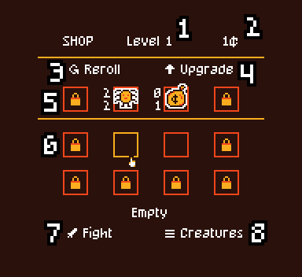

Autoween is an autochess made for the [GBJAM 12](https://itch.io/jam/gbjam-12). The theme was _spooky_.

The goal of the game is to manage a board of 4x2 minions.

- **Arrow keys / WASD**: select items
- **Space / Enter / K**: confirm
- **Escape / J**: return
- **Tab / H / Ctrl**: hide popups in the shop

All minions have an ATK and HP stats.
They can also have an effect that triggers during the fight.

- **Pumpkins**: Pumpkins boost other towers. Pumpkins shoot only after receiving damage.
- **Spiders**: Spiders have effects related to permanent boosts.
- **Ghosts**: Ghosts can become <strong>ghostly, in this state the next shot received will not inflict any damage.
- **Skeletons**: Skeletons have effects related to attack bonuses and shooting more often.

1. Level of the shop.
2. Money available. Resets and increase each turn.
3. Reroll the minions in the shop.
4. Upgrade the level of the shop. Higher levels have better minions.
5. Minions that can be bought. The left and right slots can be unlocked at any time to get more minion options. 
6. Your board. It is possible to move or sell minions after selecting them.
7. End the shop phase and start the fight.
8. Open the gallery of all minions from all shop levels.

Fights are automatic! Columns activates one after each other, from left to right.
All boosts that aren't permanent will be removed after the fight.

The fight ends when no column can shoot anymore (pumpkins and minions with 0 ATK can't shoot), or when one team does not have any HP left.

- **Vicreator**: BGM, SFX (Ableton Live)
- **yopox**: Code (Godot 4.3, JetBrains Rider), pixel art (Aseprite)

Thanks Oriol for helping with testing the game :)